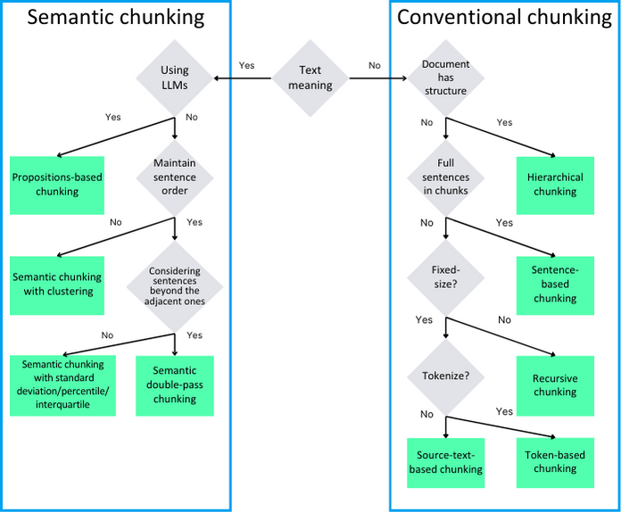

# Chunking
Entre los métodos de fragmentación, se pueden identificar dos subgrupos principales. El primer grupo consiste en los métodos de fragmentación convencionales, que dividen el documento en fragmentos sin considerar el significado del texto en sí. El segundo grupo consiste en los métodos de fragmentación semántica, que dividen el texto en fragmentos mediante el análisis semántico. El diagrama a continuación ilustra cómo distinguir entre los distintos métodos.

## Ejemplo
- Recursive Character Chunking (1)
- Document Specific Chunking (1)
- Semantic Chunking(Content Aware) (2)


# Estrategia de Document Specific Chunking para Leyes

Para implementar una estrategia efectiva de chunking específica para documentos legales (leyes, códigos, reglamentos), consideraría la siguiente aproximación:

## Estructura típica de una ley

Las leyes generalmente tienen esta estructura jerárquica:
1. **Título** de la ley
2. **Capítulos** (opcionales)
3. **Artículos** (unidad básica)
4. **Párrafos** o **incisos** dentro de artículos
5. **Numerals** o **letras** para listados

## Estrategia de chunking recomendada

### 1. Chunking por Artículo (nivel básico recomendado)
```python
def chunk_by_article(document_text):
    # Dividir por líneas que comiencen con "Artículo" o "ARTÍCULO" seguido de número
    articles = re.split(r'\n\s*Art[íi]culo\s+\d+[°º]*\.', document_text)
    # El primer elemento suele ser el preámbulo/título
    chunks = []
    for i, article in enumerate(articles[1:], start=1):
        chunks.append({
            'type': 'article',
            'number': i,
            'content': f"Artículo {i}.\n{article.strip()}"
        })
    return chunks
```

### 2. Chunking jerárquico (para leyes complejas)
```python
def hierarchical_law_chunking(document_text):
    chunks = []
    
    # Dividir por capítulos primero
    chapters = re.split(r'\n\s*CAP[ÍI]TULO\s+[IVXLCDM]+\n', document_text)
    
    for chapter_num, chapter_content in enumerate(chapters[1:], start=1):
        # Dividir capítulo en artículos
        articles = re.split(r'\n\s*Art[íi]culo\s+\d+[°º]*\.', chapter_content)
        
        for art_num, article_content in enumerate(articles[1:], start=1):
            chunks.append({
                'type': 'article',
                'chapter': chapter_num,
                'number': art_num,
                'content': f"CAPÍTULO {roman_numeral(chapter_num)}\nArtículo {art_num}.\n{article_content.strip()}"
            })
    
    return chunks
```

### 3. Chunking con contexto (para mejor comprensión)
```python
def contextual_law_chunking(document_text, window_size=2):
    articles = chunk_by_article(document_text)
    chunks = []
    
    for i in range(len(articles)):
        # Agregar artículos adyacentes como contexto
        start = max(0, i - window_size)
        end = min(len(articles), i + window_size + 1)
        context = [articles[j]['content'] for j in range(start, end)]
        
        chunks.append({
            'main_article': articles[i]['number'],
            'content': "\n\n".join(context),
            'context_articles': list(range(start+1, end+1))
        })
    
    return chunks
```
## Ejemplo de un trabajo de RAG en documento legales
1. Extraer la estructura del documento
2. Crear chunk separados a partir de la estructura
3. Crear un gráfico léxico de la estructura del documento
4. Crear chunks y vincularlos a los nodos del gráfico léxico
5. Crear un grafo de definiciones
6. Importar los grafos en un indice para ellos(WhyHow.AI)
7. Una vez ingresada una query se realiza una búsqueda vectorial, que devuelve chunks de respuesta que tienen una nota al pie
8. Si los chunks recuperados tienen referencias a otros chunks se entra en un proceso recursivo para ir recuperando todos los documentos que tienen relacion con la respuesta
9. Se da una respuesta

## Problemas en documentos legales
Uno de los problemas más específicos que  encontrados en documentos, en particular en documentos legales, ha sido la necesidad de jerarquizar las diferentes cláusulas dentro del documento. Esto se debe a que, en ocasiones, las cláusulas hacían referencia a otras cláusulas para obtener el significado y el contexto completos.

Para obtener el contexto completo, es necesario navegar recursivamente y recuperar las cláusulas mencionadas (¡e incluso las notas al pie!), navegar por el gráfico de jerarquía del documento para encontrar la cláusula mencionada, comprobar si se mencionaban otras cláusulas y repetir el proceso. La recuperación recursiva puede realizarse en una variedad de elementos del documento, además de los legales, como números de página, datos multimodales como imágenes, hipervínculos a otros documentos o datos externos, etc.

## Recomendaciones adicionales

1. **Preprocesamiento**:
   - Normalizar formato (eliminar múltiples espacios, saltos de línea inconsistentes)
   - Identificar y estandarizar secciones (Títulos, Capítulos, Artículos)

2. **Metadatos**:
   - Incluir siempre el número de artículo y capítulo
   - Mantener referencias cruzadas (ej: "según lo establecido en el Artículo 12")

3. **Casos especiales**:
   - Para artículos muy largos, considerar dividirlos en párrafos
   - Para artículos muy cortos, agruparlos con vecinos

4. **Implementación con NLP**:
```python
from transformers import AutoTokenizer

tokenizer = AutoTokenizer.from_pretrained("bert-base-multilingual-cased")

def chunk_with_token_limit(chunks, max_tokens=512):
    final_chunks = []
    for chunk in chunks:
        tokens = tokenizer.tokenize(chunk['content'])
        if len(tokens) <= max_tokens:
            final_chunks.append(chunk)
        else:
            # Dividir el artículo en partes más pequeñas
            paragraphs = chunk['content'].split('\n\n')
            for i, para in enumerate(paragraphs):
                final_chunks.append({
                    **chunk,
                    'subpart': i+1,
                    'content': para
                })
    return final_chunks
```

Esta estrategia mantiene la integridad estructural de las leyes mientras crea chunks manejables para sistemas de procesamiento de lenguaje natural.


# Métodos de Búsqueda
- Posiblemente extender la búsqueda con Hybrid Search
- Agregar un paso de Reranking antes de devolver la información(Cross-Encoding ReRanker, como Sbert, MiniLM, Colbert)
